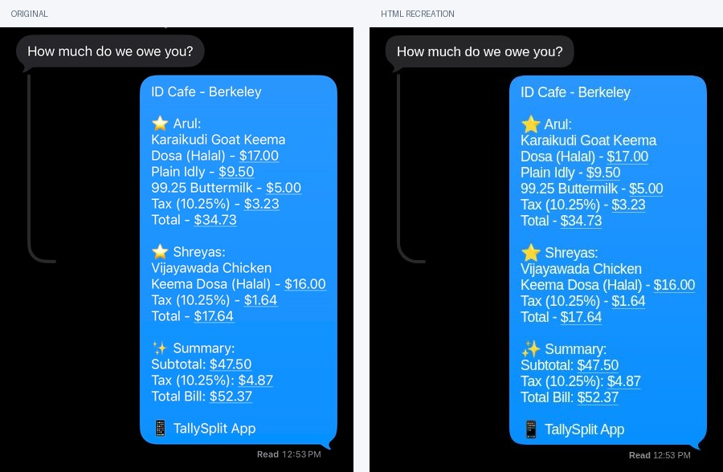

<div align="center">

# iMessage HTML Recreation

**Compose familiar conversations with HTML.**

Continuous bubble tails · Optional conversation UI · Native web components · Zero runtime dependencies

<p align="center">
  <a href="https://github.com/Amargol/imessage-html-recreation/actions/workflows/ci.yml"></a>
  <a href="https://www.npmjs.com/package/imessage-html-recreation"></a>
  <a href="https://www.npmjs.com/package/imessage-html-recreation"></a>
  <a href="LICENSE"></a>
</p>

**[Live playground](https://amargol.github.io/imessage-html-recreation/) · [Rich editor](https://amargol.github.io/imessage-html-recreation/editor/) · [npm](https://www.npmjs.com/package/imessage-html-recreation)**

[Quick start](#quick-start) · [Components](#component-api) · [Customization](#customization) · [React](#react) · [Reference verification](#reference-verification)

</div>



```html
<script type="module" src="./imessage/index.js"></script>

<imessage-conversation>
  <imessage-bubble direction="received">How much do we owe you?</imessage-bubble>
  <imessage-bubble direction="sent" status="Read 12:53 PM">$17.64 each!</imessage-bubble>
</imessage-conversation>
```

## Why this exists

Small details make a message screenshot feel native: the continuous curve of a bubble, the way its tail meets the body, the line spacing, and the quietly aligned read receipt. This library recreates those details with selectable HTML text and a measured SVG background.

Use two bubbles on their own, or compose a complete conversation. The profile, back button, video button, status bar, input, add button, reply connector, and keyboard are independently optional. The demo has editable messages, dark and light appearances, custom colors, generated HTML, and live screenshot overlays.

**Status:** version 0.1.0. GitHub Pages deploys the demo from `main`; npm publishing is automated through Trusted Publishing when the package version changes.

## Quick start

Install from npm, or copy `packages/imessage-html-recreation/` to your website as `imessage/`, then load `index.js` as a module. Keep the files together. The components themselves require no build step and do not fetch external scripts or fonts.

```sh
npm install imessage-html-recreation
```

For a local checkout instead:

```sh
npm install ./packages/imessage-html-recreation
```

Then import once in a browser entry point:

```js
import 'imessage-html-recreation';
```

When rendering on the server, register in the browser after mount. Importing the module in Node is safe, but element creation requires a document. Modern Chromium and Safari support the underlying custom elements, Shadow DOM, and ResizeObserver APIs; platform testing performed for this release is listed below.

### Complete conversation

```html
<imessage-conversation theme="dark">
  <imessage-status-bar slot="status-bar" time="9:41"></imessage-status-bar>
  <imessage-header slot="header" name="Alex" avatar="/avatar.jpg"
    back="true" video="false" unread="3"></imessage-header>

  <imessage-timestamp>Today 12:53 PM</imessage-timestamp>
  <imessage-bubble direction="received">How much do we owe you?</imessage-bubble>
  <imessage-thread>
    <imessage-bubble direction="sent" status="Read 12:53 PM">$17.64 each!</imessage-bubble>
  </imessage-thread>

  <imessage-composer slot="composer" plus="true"></imessage-composer>
  <!-- Optional: <imessage-keyboard slot="keyboard"></imessage-keyboard> -->
</imessage-conversation>
```

Leave an element out to disable it. These are string-valued flags: `back="false"` hides a button; an absent attribute uses its default. Text is preserved, including literal newlines and indentation. Keep short messages on one source line unless you intend the whitespace. Use `<br>` for deliberate breaks.

### JavaScript convenience API

```js
import { createConversation, ready } from 'imessage-html-recreation';

const conversation = createConversation({
  messages: [
    { direction: 'received', text: 'How much do we owe you?' },
    { direction: 'sent', text: '$17.64 each!', status: 'Delivered' },
  ],
  header: true,
  name: 'Alex',
  back: false,
  composer: true,
});

document.querySelector('#app').append(conversation);
await ready();
```

The factory treats messages as text, never as executable HTML. If your application puts rich HTML into a bubble, sanitize any untrusted HTML first. The library itself makes no messaging, contact, audio, camera, or network calls. An explicitly provided `avatar` URL is loaded as a normal image.

## Component API

| Element | Attributes | Defaults / behavior |
| --- | --- | --- |
| `imessage-conversation` | `theme` | `dark`; `light` adjusts background, received bubble and chrome. Named slots: `header`, `status-bar`, `composer`, `keyboard`; default slot holds messages. |
| `imessage-bubble` | `direction`, `tail`, `status`, `group`, `width` | `received`, tail on, no receipt. `direction="sent"` aligns right. `width` accepts a CSS width such as `246px`. |
| `imessage-header` | `name`, `avatar`, `back`, `video`, `unread` | Name `Alex`; initials when no image. Back and video on. Badge hidden when unread is empty. |
| `imessage-composer` | `placeholder`, `plus`, `microphone`, `value` | Placeholder `iMessage`; plus and microphone on. Typing reveals send. `value` updates the input when the attribute changes. |
| `imessage-timestamp` | — | Centered slotted text. |
| `imessage-thread` | — | Optional curved reply connector behind its children. |
| `imessage-status-bar` | `time`, `island` | Time `9:41`; blank island shown unless `island="false"`. Icons are decorative. |
| `imessage-keyboard` | — | QWERTY visual keyboard; letter/space/delete/return emit key events. Mode, shift and dictation buttons emit action events for a host to implement. |

For consecutive bubbles, use `group="first"`, `group="middle"`, and `group="last"`. First and middle suppress the tail and use a 3px gap. Standalone bubbles have a tail unless `tail="false"`. The default maximum width is 78% of the message column.

A profile image can also be slotted:

```html
<imessage-header name="Alex" back="false">
  
</imessage-header>
```

Useful styling parts are `bubble`, `text`, `status`, `messages`, `header`, `avatar`, `composer`, `input`, `thread`, and `status-bar`. The components use open Shadow DOM to isolate their UI from page resets. Slotted text and HTML remain in the document.

## Customization

Set CSS properties on a conversation, a bubble, or an ancestor:

```css
imessage-conversation {
  --im-background: #000;
  --im-sent-top: #2995ff;
  --im-sent-bottom: #078fff;
  --im-received: #262628;
  --im-font-size: 17px;
  --im-line-height: 20px;
  --im-max-width: 78%;
}
```

| Property | Default | Controls |
| --- | --- | --- |
| `--im-background` | `#000` / `#fff` | Conversation background |
| `--im-sent-top`, `--im-sent-bottom` | `#2995ff`, `#078fff` | Sent gradient; set both equal for a solid color |
| `--im-received` | `#262628` / `#e9e9eb` | Received fill |
| `--im-incoming-text`, `--im-outgoing-text` | White; incoming black in light theme | Message foreground |
| `--im-muted` | `#8e8e93` | Timestamp and receipt |
| `--im-font` | Apple system stack, Helvetica Neue, Arial | Typeface; no font files are bundled |
| `--im-font-size`, `--im-line-height` | `17px`, `20px` | Base type size and line height |
| `--im-letter-spacing`, `--im-sent-letter-spacing` | Platform-calibrated | Tracking overrides |
| `--im-radius` | `22` | Bubble radius in pixels, unitless |
| `--im-padding-x`, `--im-padding-y` | `14px`, `10px` | Bubble padding (vertical optical offset +1/-1px) |
| `--im-max-width` | `78%` | Maximum bubble width |
| `--im-message-gap` | `10px` | Space between standalone messages |
| `--im-inset-x`, `--im-inset-top`, `--im-inset-bottom` | `20px`, `12px`, `12px` | Conversation content padding |
| `--im-thread-color`, `--im-thread-height` | `#292929`, `234px` | Reply connector |
| `--im-glass`, `--im-chrome-text` | Theme-derived | Header button surfaces and foreground |
| `--im-input`, `--im-input-border`, `--im-composer-inset` | Theme-derived, `20px` | Input styling and side inset |

`width` and `--im-max-width` interact: an explicit width still respects the maximum, so content remains contained on small screens. Changing the background does not break the tail because there is no background-colored masking circle. Text changes, resizing and font loading trigger remeasurement. After externally changing `--im-radius` without changing dimensions, call `bubble.refresh()`; `ready()` refreshes all bubbles after fonts and two animation frames.

## React

React 18+ is an optional peer dependency. The plain HTML package has no runtime dependencies.

```tsx
'use client';
import { Conversation, Bubble, Header, Composer } from 'imessage-html-recreation/react';

export function Example() {
  return (
    <Conversation theme="dark">
      <Header slot="header" name="Alex" back={false} video={false} />
      <Bubble direction="received">Hey!</Bubble>
      <Bubble direction="sent" status="Delivered">Hello!</Bubble>
      <Composer slot="composer" onSend={({ text }) => console.log(text)} />
    </Conversation>
  );
}
```

Also exports `Timestamp`, `Thread`, `StatusBar`, and `Keyboard`. Components forward refs to the underlying elements and accept ordinary HTML props including `className`, `style`, `slot`, and `aria-*`. Callback props receive the event detail followed by the original CustomEvent. Browser registration happens after mount.

## Events

| Event | Detail | React callback |
| --- | --- | --- |
| `imessage:send` | `{ text }` | `onSend` |
| `imessage:back` | `{}` | `onBack` |
| `imessage:profile` | `{}` | `onProfile` |
| `imessage:video` | `{}` | `onVideo` |
| `imessage:add` | `{}` | `onAdd` |
| `imessage:microphone` | `{}` | `onMicrophone` |
| `imessage:key` | `{ key }` | `onKey` |
| `imessage:keyboard-action` | `{ key }` | `onKeyboardAction` |

All events bubble and are composed across Shadow DOM. The conversation connects an optional keyboard to its composer. The composer clears after submission, but adding a bubble is application logic:

```js
conversation.addEventListener('imessage:send', ({ detail }) => {
  const message = document.createElement('imessage-bubble');
  message.setAttribute('direction', 'sent');
  message.textContent = detail.text;
  conversation.append(message);
});
```

## Reference verification

The supplied screenshots established the reference geometry. The current distribution retains the message-only screenshot, captures, overlays, and difference image; photo-bearing references have been removed. The demo provides live opacity, difference, and side-by-side modes.

| Reference | Fixture | Overlay |
| --- | --- | --- |
| Messages and reply thread | [HTML](public/examples/messages.html) | [Overlay](docs/verification/messages-overlay.jpg) |
| Full conversation | [HTML](public/examples/conversation.html) | Fictional-avatar HTML fixture |
| Keyboard open | [HTML](public/examples/keyboard.html) | Fictional-avatar HTML fixture |

[Measured results](docs/verification/metrics.json) · [Methodology](docs/VERIFICATION.md)

**This is not a pixel-identical reproduction on every platform.** The message bubble geometry and reference line layout are calibrated. Apple system fonts are used when available and are not redistributed; the fallback uses a small optical size adjustment for sent text. Emoji designs, font contours, antialiasing, display color profiles, and Liquid Glass differ. The live activity in the status island is represented by a blank island. The keyboard is a component, not the OS keyboard.

Chrome rendering and demo interactions have been checked. Safari and Firefox are not independently verified. Native Apple typography is selected by the CSS system font stack and a Safari feature query; it should be checked on the target device before claiming a 1:1 result.

For captures, use an actual browser screenshot after `ready()`. DOM-to-canvas libraries may not reproduce Shadow DOM or backdrop blur reliably. The core library does not encode images or video.

The message-only screenshot is a demonstration asset supplied for this recreation. The demo portrait is generated and fictional. They are kept outside the npm package, and are not covered by the code's MIT license. No Apple fonts or SF Symbols files are redistributed.

## Development

The root is the Sites demo; the distributable package is `packages/imessage-html-recreation`.

```sh
corepack enable
pnpm install --frozen-lockfile
pnpm run build:lib
pnpm dev
```

```sh
pnpm test
pnpm run typecheck
pnpm run build:lib
pnpm build
```

`build:lib` copies the dependency-free components to the demo and generates the executable reference fixtures. The root's build uses Vinext for Sites; the library works independently in any HTML page. Commit library source, generated public copies, and updated verification artifacts together.

See [CONTRIBUTING.md](CONTRIBUTING.md), [CHANGELOG.md](CHANGELOG.md), and the CI workflow. No automatic publishing workflow is enabled. After attaching your GitHub repository, add its `repository` URL to the package metadata and publish intentionally. To inspect the exact npm payload without publishing:

```sh
cd packages/imessage-html-recreation
npm pack --dry-run
```

## License

Code: [MIT](LICENSE). Independent project; not affiliated with or endorsed by Apple. iMessage is an Apple trademark.

## Demo routes

- `/`: landing page with an automatically animated HTML conversation. Pause and replay controls are included; reduced-motion preferences show the complete conversation.
- `/editor`: full message-stack editor with ordering, direction, receipts, profile details, back button and count, status time and island, composer, keyboard, colors, and sizing.
- `/editor?tab=compare`: original screenshot overlays and difference views.
- `/editor?tab=docs`: component API and usage examples.

The homepage renders the actual React wrappers and custom elements, not video. All editor previews and HTML exports use the shared component library.

### Full editor configuration

Five presets — Just messages, Conversation, Full phone, With keyboard, and Bill split — only set editable configuration values. The editor includes collapsible sections for the message stack, profile/navigation, status bar/dates, composer/keyboard, scrolling, and colors/type. Per-message controls include direction, text, timestamp, receipt (none/delivered/read/custom), receipt time, width, grouping, and tail.

The public factory supports `header`, `statusBar`, and `composer` as either booleans or option objects. See `packages/imessage-html-recreation/README.md` for the full example. Set `scrollable: true` and `height: 956` for a fixed keyboard layout; leave scrolling off for an expanding composition. React exposes the equivalent `scrollable`, `photo`, `clock`, `signal`, `wifi`, `battery`, and `island` props. Dates are explicit text labels, so captures stay deterministic.


## Accurate device sizing — recommended integration

The library is calibrated in a **440 × 956 logical CSS-pixel coordinate system**, matching the supplied full-device reference's aspect ratio (1320 × 2868 at 3×). This is a reference profile, not a claim that every iPhone uses these dimensions.

Use `<imessage-viewport>` for a screenshot-like device composition. It lays out content at its logical width and height, then scales the whole canvas uniformly to the available width. At a displayed width of 330px, everything scales by 0.75: text, bubble padding, tails, header, icons, and composer. The resulting height is 717px. Text does not rewrap just because the surrounding landing-page column gets narrower.

```html
<script type="module" src="./imessage/index.js"></script>
<div style="max-width:380px">
  <imessage-viewport width="440" height="956">
    <imessage-conversation scrollable="true" style="--im-height:956px">
      <imessage-status-bar slot="status-bar" time="9:41"></imessage-status-bar>
      <imessage-header slot="header" name="Alex" avatar="./alex.png"></imessage-header>
      <imessage-timestamp>Today 9:41 AM</imessage-timestamp>
      <imessage-bubble direction="received">How much do we owe you?</imessage-bubble>
      <imessage-bubble direction="sent" status="Read 9:41 AM">$17.64 each!</imessage-bubble>
      <imessage-composer slot="composer"></imessage-composer>
    </imessage-conversation>
  </imessage-viewport>
</div>
```

React exports `Viewport` with `width` and `height` props; use the same nesting. For a flat message-only crop, choose a logical height that fits the messages and omit `scrollable`; continue to scale uniformly. The editor already renders its previews at a fixed 440px logical width before scaling.

## Preserve the reference geometry

- Keep default 17px text, 20px line height, 20px horizontal conversation insets, 10px message gaps, and 78% maximum bubble width. Internal fallback-font compensation is already included; do not apply another correction.
- Keep the 58px status bar, 100px profile header with 60px portrait, 44px navigation controls, and native composer. Do not replace components with approximately styled copies.
- Use one scale factor on the entire canvas. Do not shrink only the text, tighten only the margins, or stretch width and height independently to fit a card. Do not combine percentage-width layout with independent font-size breakpoints.
- Surrounding page styles can override custom-element host styles. CSS resets such as `* { margin: 0 }` must be scoped away from conversation descendants, or restore bubble margins explicitly: `imessage-bubble { margin:0 auto 10px 0 } imessage-bubble[direction="sent"] { margin-left:auto; margin-right:0 }`. Shadow DOM protects internal styles, not host styles.
- Use an iframe with a minimal stylesheet when embedding into an unknown CSS environment. This is how the editor isolates exported compositions.
- Treat decorative bezels as outside the screenshot canvas. Do not subtract a thick border from the logical viewport or invent an arbitrary phone aspect ratio.
- For another device profile, set its actual logical dimensions and recalibrate against that device's screenshot; changing viewport width can legitimately change line wrapping.

## Check the result

Use the same text and logical dimensions as the reference. Compare at the same displayed scale, checking line breaks, received/sent alignment, bubble tails, header size, and composer placement. Use the editor's message overlay for bubble geometry. Check desktop and mobile displays without modifying the internal layout. Test on Safari/iOS for final font and emoji fidelity; Linux fallback rendering and approximate Liquid Glass cannot be claimed as pixel-identical to iOS.

All example portraits must be fictional or explicitly supplied for public reuse. The current demo uses a generated fictional portrait; personal profile screenshots are excluded from the current downloadable source.

### Message arrival animations

Add `entrance` to newly inserted bubbles for a short upward glide and expansion, with direction-aware origins, smooth space allocation, and a delayed receipt fade. Existing messages stay still. Motion respects `prefers-reduced-motion` and preserves the final device sizing.

```html
<imessage-bubble direction="sent" entrance>On my way!</imessage-bubble>
```

In React use `<Bubble direction="sent" entrance>On my way!</Bubble>`. Append messages with stable keys so previous bubbles are not remounted. Call `bubble.reveal()` to replay an entry explicitly. Omit `entrance` for static compositions and screenshot comparisons.
